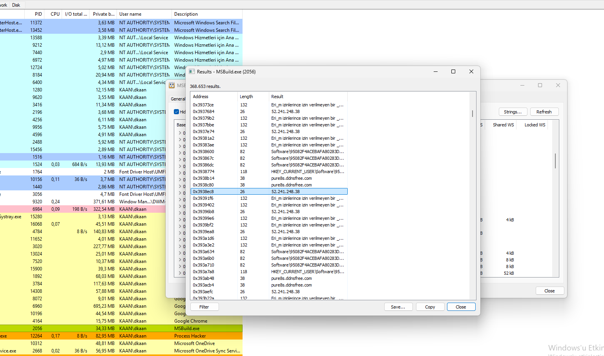
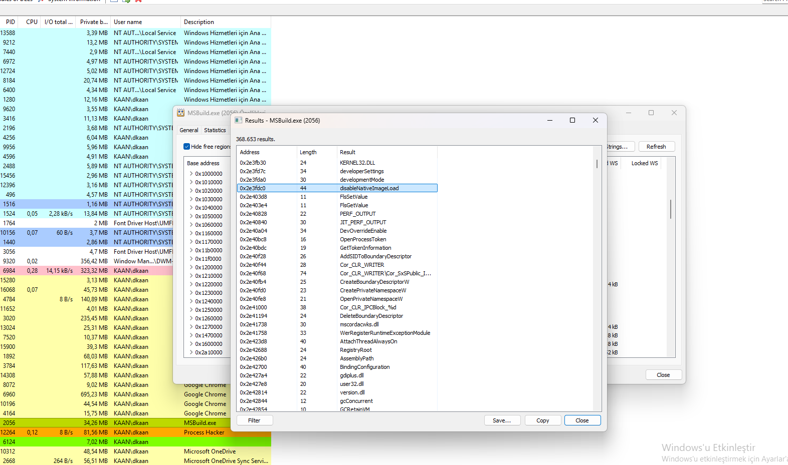
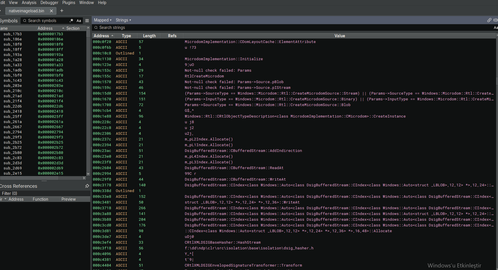
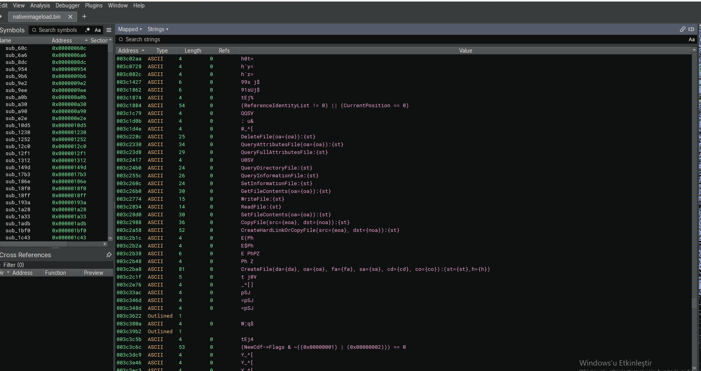
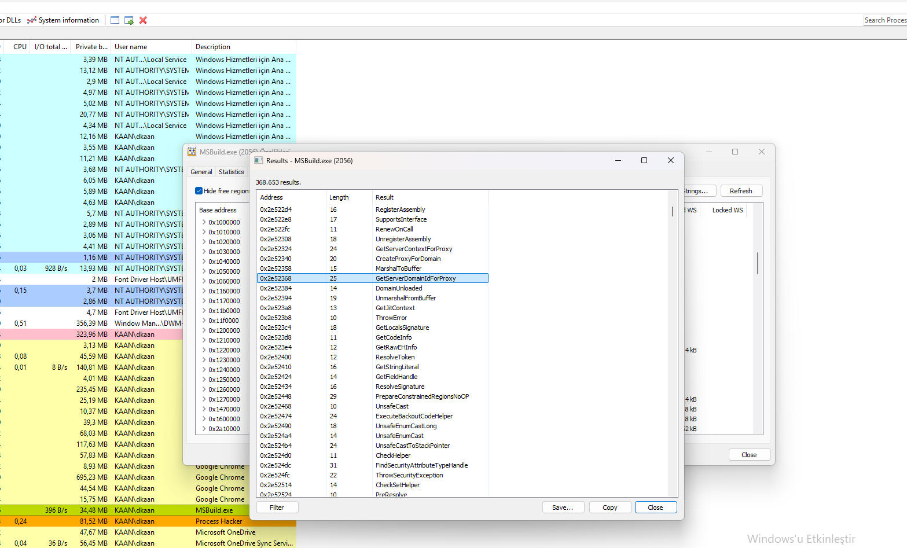
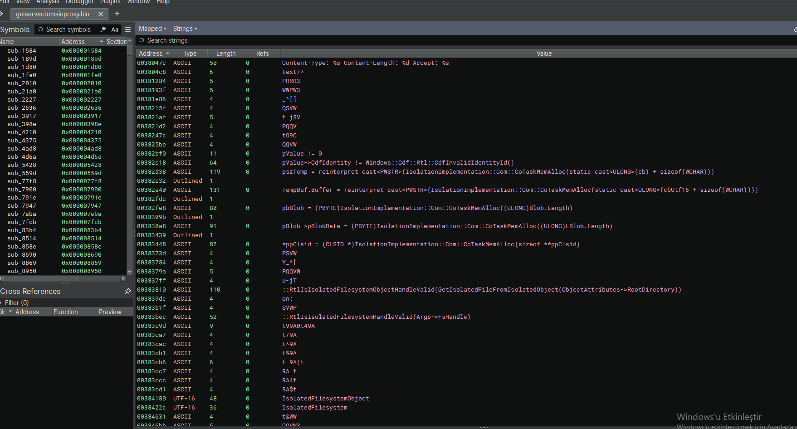

## 1. msbuild.exe Execution & C2 Addresses

Process Hacker memory analysis reveals that PureRAT executes via `msbuild.exe` (a legitimate Microsoft build tool) and connects to multiple C2 servers.

### Key Observations:

- **Target Process:** `MSBuild.exe` (PID 2056).
- **C2 Domain:** `pure8s.ddnsfree.com`
- **C2 IP Address:** `52.241.248.38`
- **Registry Key:** `HKEY_CURRENT_USER\Software\95082F4ACEBFA802830...`
- **Turkish String:** `Erişim izinlerinize izin verilmeyen bir...` (Access denied error message).

### Why This Matters:

- **Living Off the Land:** `msbuild.exe` is a legitimate tool abused for execution.
- **C2 Redundancy:** Both domain and IP address are used for communication.
- **Persistence:** Registry key indicates persistence mechanism.

### Visual Reference:

*Process Hacker view showing msbuild.exe strings with C2 domain (`pure8s.ddnsfree.com`) and IP (`52.241.248.38`).*

## 2. .NET Manipulation & Evasion Techniques

Process Hacker memory analysis of `msbuild.exe` reveals that PureRAT uses .NET manipulation and evasion APIs to avoid detection.

### Key Strings Observed:

- **`DisableNativeImageLoad`** – Disables native image loading (evasion).
- **`FlsSetValue` / `FlsGetValue`** – Fiber Local Storage (anti-debug).
- **`OpenProcessToken` / `GetTokenInformation`** – Token manipulation (privilege escalation).
- **`CreateBoundaryDescriptorW`** – Creates boundary descriptors (sandbox evasion).
- **`mscordacwks.dll`** – .NET debugging DLL (potential debugging evasion).
- **`AssemblyPath` / `BindingConfiguration`** – .NET assembly loading.
- **`WerRegisterRuntimeExceptionModule`** – Error reporting manipulation.
- **`AttachThreadAlwaysOn`** – Thread attachment (injection).

### Why This Matters:

- **.NET Manipulation:** `AssemblyPath` and `BindingConfiguration` confirm .NET usage.
- **Evasion:** `DisableNativeImageLoad` and `CreateBoundaryDescriptorW` help avoid detection.
- **Privilege Escalation:** `OpenProcessToken` enables token manipulation.
- **Anti-Debug:** `FlsSetValue` and `AttachThreadAlwaysOn` complicate analysis.

### Visual Reference:

*Process Hacker view showing `DisableNativeImageLoad`, `OpenProcessToken`, and other evasion APIs.*

## 3. DisableNativeImageLoad – .NET Assembly & XML Manipulation

Binary Ninja analysis of the saved `DisableNativeImageLoad` code reveals that PureRAT uses .NET assembly manipulation and XML-based data structures.

### Key Strings Observed:

- **`MicrodomImplementation`** – Microsoft XML DOM implementation.
- **`CreateMicrodomSource`** – Creates XML DOM source (configuration).
- **`DsiGBufferedStream`** – Buffered stream for data processing.
- **`CRTIXMLDSIGBaseHasher`** – XML digital signature hashing.
- **`CRTIXMLDSIGEnvelopedSignatureTransformer`** – XML signature transformation.
- **`AssemblyPath`** – .NET assembly path.
- **`BindingConfiguration`** – .NET binding configuration.

### Why This Matters:

- **.NET Usage:** Confirms PureRAT is a .NET-based RAT.
- **XML Manipulation:** Uses XML for configuration and digital signatures.
- **Data Processing:** `DsiGBufferedStream` handles large data streams.
- **Evasion:** `DisableNativeImageLoad` prevents native image loading, complicating analysis.

### Visual Reference:

*Binary Ninja view showing `MicrodomImplementation`, `DsiGBufferedStream`, and XML signature APIs.*

## 4. DisableNativeImageLoad (Continued) – File System & CDF Manipulation

This section continues the Binary Ninja analysis of the `DisableNativeImageLoad` code from the previous section. It reveals file system operations and CDF (Component Definition File) manipulation used by PureRAT.

### Key Observations:

- **File Operations:** `DeleteFile`, `QueryAttributesFile`, `QueryDirectoryFile`, `WriteFile`, `ReadFile`, `CopyFile`, `CreateHardLinkOrCopyFile`, `CreateFile` – full file system control.
- **CDF Validation:** `(ReferenceIdentityList != 0) || (CurrentPosition == 0)` – validates CDF references.
- **CDF Flags:** `(NewCdf->Flags & ~((0x00000001) | (0x00000002))) == 0` – checks CDF flags.
- **Path Manipulation:** `CreateFile(da={da}, oa={oa}, fa={fa}, sa={sa}, cd={cd}, co={co}):(st={st}.h={h})` – constructs file paths dynamically.

### Why This Matters:

- **File System Control:** The malware can create, read, write, and delete files.
- **CDF Manipulation:** Used for configuration and identity management.
- **Evasion:** Dynamic path construction helps avoid detection.

### Visual Reference:

*Binary Ninja view showing file operations, CDF validation, and dynamic path construction.*

## 5. .NET Remoting & Proxy Manipulation

Process Hacker memory analysis of `msbuild.exe` reveals that PureRAT uses .NET Remoting and proxy APIs for inter-process communication and code injection.

### Key Strings Observed:

- **`GetServerDomainIdForProxy`** – Retrieves server domain ID for proxy.
- **`RegisterAssembly`** – Registers a .NET assembly.
- **`CreateProxyForDomain`** – Creates a proxy for a domain.
- **`MarshalToBuffer` / `UnmarshalFromBuffer`** – Serializes/deserializes data.
- **`GetLocalSignature`** – Retrieves local signature.
- **`ThrowException`** – Throws exceptions (error handling).
- **`UnsafeCast` / `UnsafeEnumCast`** – Unsafe type casting (evasion).
- **`ExecuteBackoutCodeHelper`** – Executes backout code.

### Why This Matters:

- **.NET Remoting:** `GetServerDomainIdForProxy` confirms remoting usage.
- **Proxy Manipulation:** `CreateProxyForDomain` enables IPC.
- **Data Serialization:** `MarshalToBuffer` and `UnmarshalFromBuffer` handle data.
- **Evasion:** `UnsafeCast` and `UnsafeEnumCast` help bypass type safety.

### Visual Reference:

*Process Hacker view showing `GetServerDomainIdForProxy`, `RegisterAssembly`, and other Remoting APIs.*

## 6. GetServerDomainIdForProxy – HTTP, COM & Isolated Filesystem

This section continues the Binary Ninja analysis of the `GetServerDomainIdForProxy` code from the previous section. It reveals HTTP communication, COM (Component Object Model) usage, and isolated filesystem operations used by PureRAT.

### Key Observations:

- **HTTP Communication:** `Content-Type: %s Content-Length: %d Accept: %s` – used for C2 communication.
- **COM Memory:** `CoTaskMemAlloc` and `IsolationImplementation::Com` – allocates memory for COM objects.
- **CLSID Assignment:** `*ppClsid = (CLSID *)...` – assigns a COM class identifier.
- **Isolated Filesystem:** `IsolatedFilesystemObject` and `RtlIsIsolatedFilesystemObjectHandleValid` – validates isolated filesystem handles.

### Why This Matters:

- **C2 Communication:** HTTP headers confirm web-based C2.
- **COM Usage:** COM objects enable system-level operations.
- **Isolated Filesystem:** Used to hide file operations from security tools.

### Visual Reference:

*Binary Ninja view showing HTTP headers, COM memory allocation, CLSID assignment, and isolated filesystem APIs.*

## Conclusion

This analysis uncovered **PureRAT**, a sophisticated fileless RAT that executes via `msbuild.exe` and uses advanced .NET evasion techniques.

### Key Takeaways:

- **Fileless Execution:** Runs entirely in memory via `msbuild.exe`.
- **C2 Infrastructure:** Connects to `pure8s.ddnsfree.com` and `52.241.248.38`.
- **.NET Evasion:** Uses `DisableNativeImageLoad` and `OpenProcessToken`.
- **File System Control:** Full file operations (`DeleteFile`, `WriteFile`, `ReadFile`, `CopyFile`, `CreateFile`).
- **CDF Manipulation:** Validates and manipulates CDF (Component Definition File) references.
- **HTTP, COM & Isolated Filesystem:** Uses HTTP headers, COM memory allocation, and isolated filesystem APIs.
- **Persistence:** Startup VBScript and registry key (`HKEY_CURRENT_USER\Software\95082F4ACEBFA802830...`).

### Detection Recommendations:

- Block C2 domains: `pure8s.ddnsfree.com` and IP `52.241.248.38`.
- Monitor for `msbuild.exe` executing unusual commands.
- Detect `DisableNativeImageLoad` and `OpenProcessToken` calls.
- Monitor for file operations from `msbuild.exe`.
- Check startup folder for suspicious VBScript files.

### Sample Download

The analyzed PureRAT sample is available on MalwareBazaar for those who wish to conduct their own analysis:

🔗 **[PureRAT Sample on MalwareBazaar](https://bazaar.abuse.ch/sample/db4b6c524cbbdb661779fbc66a2f4c7369df8babc733ef965b279542477b2aca)**

**Tools Used:** Process Hacker, Binary Ninja,x64dbg

